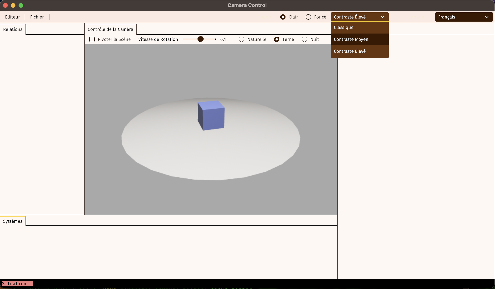

# Beverage

#### _Also available as a t-shirt._

---

In one terminal, cargo run --example server

In another, just cargo run

In the bottom left corner of the editor window, a label indicates the network connection status.
It is red when disconnected, yellow when a connection has been initiated but not resolved, and
green when a BRP query has returned with the ID of an entity with a Camera component.

Pressing the A or D keys will rotate the editor camera and then, once connected, begin updating the
transform of the server camera each frame that it changes. Clicking rotate scene while disconnected
will not initiate a connection, but if already connected, the server window will match the rotation
even if the user is no longer pressing the A or D key.

In addition, when connected, the F key will toggle an FPS counter in the server window.

Selecting a setting in the right side of the menu bar will adjust the color theme settings of
sickle and switch the UI language using the asset-driven workflow of bevy_fluent.

Controls are mapped via leafwing-input-manager, except for the UI debug outlines which appear to be
hard-wired to the space bar.

This is what I originally set out to do: make a sickle demo where the editor chrome was starting to
get hooked up to some actual functions, including the Bevy Remote Protocol (BRP), explore
asset-driven localization and how to manage inputs. In the very short term, I'm going to look at
serialization as it applies to sickle, to see if we can get the UI layouts themselves into assets,
and start hot-reloading our widgets. Next step from there is a widget editor that would allow
building the layout of an arbitrary, new editor widget and then serializing it to a file.

Well, the way these things work, mapping "event handlers" (actual events, observers, signals, etc)
from within a deflated widget to actual working systems defined elsewhere can be somewhat
straightforward. Just as we might add a SpawnMyWidget marker to a layout container and then have a
widget internal system scan for that marker and replace it with the actual widget bundle, so we can
also have a SpawnHandler or equivalent that describes which events should be handled in what way.
Then the system that handles them can react to its sudden presence in the ECS, and do what must be
done to wire things up behind the scenes.

This all depends on the editor framework having a basic way of providing access to its standard
components, so that's where we're going next. The basic idea is to expand on [how sickle itself
supports plugins](https://github.com/UmbraLuminosa/sickle_ui?tab=readme-ov-file#extending-sickle-ui)
and add some things like localization, input management, and other reactive properties.

In addition to basic UI editing capabilities, we would also like to implement the
[Caffeine Phase 1](https://hackmd.io/Oj7KqBOlRqGrFLxwyfYFCw) proposal, which includes adapting
the popular [Blender_bevy_components_workflow](https://github.com/kaosat-dev/Blender_bevy_components_workflow).

## 🕊 Bevy Compatibility

| bevy   | bevy_lazy_signals |
| ------ | ----------------- |
| 0.14.0 | 0.1.0             |

# License

All code in this repository is dual-licensed under either:

- MIT License (LICENSE-MIT or http://opensource.org/licenses/MIT)
- Apache License, Version 2.0 (LICENSE-APACHE or http://www.apache.org/licenses/LICENSE-2.0)

at your option. This means you can select the license you prefer.

## Your contributions

Unless you explicitly state otherwise, any contribution intentionally submitted for inclusion in the work by you, as defined in the Apache-2.0 license, shall be dual licensed as above, without any additional terms or conditions.
